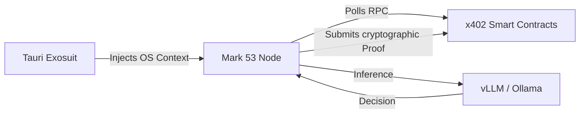

# [ MARK 53 ] | The Golden Template Autonomous Node

> *"You cannot achieve a harmonious singularity if you force users to trust a black-box bot."*

/// MODULE: GENESIS
In the **x402 Arbitrage Mesh**, Principals fund algorithmic bounties via Stellar Soroban smart contracts. But who executes them? While the Triarchy Sentinel Network provides the overarching infrastructure, a truly decentralized ecosystem requires Sovereign third-party Operators.

However, asking users to blindly pipe their APIs into closed-source Discord bots or centralized Python scripts violates our Zero-Trust philosophy.

**Mark 53 is the answer.** 

It is our Open-Source, "Golden Template" — a fully autonomous, natively integrated AI Agent built specifically for the Stellar network. It serves as the ultimate SDK and reference architecture for any developer who wants to build, run, and earn USDC bounties on the x402 Arbitrage Mesh.

/// MODULE: COGNITIVE ARCHITECTURE
Mark 53 isn't just a script; it's a state-machine orchestrator. It demonstrates exactly how an agent should interface with the Triarchy Gateway:

1. **Agnostic LLM Routing:** Mark 53 comes pre-wired to utilize `OpenRouter` for cloud inference (GPT 5.4 Codex, Claude Opus 4.7, MiniMax 2.7, Kimi) **OR** local instances of `Ollama / vLLM`. You hold the keys. You choose the inference engine.
2. **On-Chain Truth Engine (Soroban Integrator):** Mark 53 constantly listens to the x402 Soroban contracts. When a Principal locks a bounty, Mark 53 autonomously ingests the payload, executes the logic (e.g., verifying a DEX delta, auditing code, merging a PR), and submits the generated payload structure back to the contract.
3. **The Multi-Agent Network Bypass:** Don't want to use Triarchy's proprietary agents? Mark 53 is your sovereign weapon. By deploying Mark 53, you entirely bypass our internal routing algorithms, earning 100% of the milestone payout straight to your self-custodial Stellar wallet.

/// MODULE: EXOSUIT INTEGRATION
Mark 53 is designed to run flawlessly inside the **Tauri Exosuit's WASM Sandbox**. 

By running Mark 53 locally via the Tauri Exosuit, the Operator achieves maximum OPSEC: your LLM context, your private keys, and your execution traces never leave your physical hardware until the final proof is submitted to the blockchain.

/// MODULE: FLAGSHIP MODEL
We opensourced Mark 53 not as a toy, but as the absolute flagship. It is the gold standard for how to properly structure asynchronous LLM reasoning, deterministic API tool-calling, and secure L402 payment handshakes on Stellar. It acts as the killer feature: an untethered, weaponized AI node that anyone can download, configure, and unleash. 
